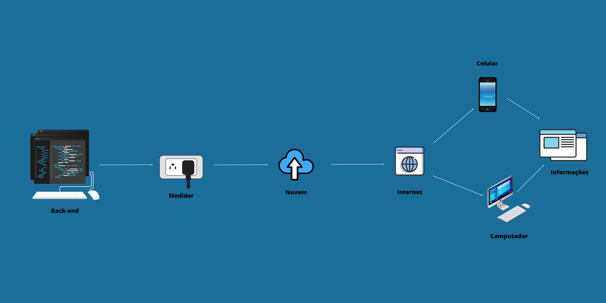

# MeterWatt ⚡ 
**Projeto Finalista NEXT FIAP 2023**

O MeterWatt é um sistema de monitoramento de energia inteligente (IoT) desenvolvido para medir o consumo em tempo real, gerando dashboards interativos para análise de eficiência energética e controle de gastos.

## 📂 Estrutura do Repositório

Para facilitar a navegação, o projeto está dividido nas seguintes pastas:

*   **/firmware**: Contém o código fonte em C++ desenvolvido para o ESP32/Arduino, responsável pela leitura dos sensores e comunicação MQTT.
*   **/src**: Contém os scripts em Python para o processamento de dados e geração do Dashboard interativo.
*   **/docs**: Documentação técnica, esquemas do circuito e registros visuais do projeto funcionando.

## 🚀 Tecnologias Utilizadas
* **Hardware:** ESP32, Sensores de Corrente (SCT-013)[cite: 1].
* **Linguagens:** C++ (Firmware) e Python (Data Visualization)[cite: 1].
* **Protocolos:** MQTT para telemetria e HTTP para integração com APIs[cite: 1].

## 📋 Funcionalidades Principais
* Medição de corrente e cálculo de potência ativa em tempo real[cite: 1].
* Integração com Broker MQTT para monitoramento remoto[cite: 1].
* Dashboard interativo para visualização histórica de consumo[cite: 1].
* Sistema de alertas configuráveis para limite de gastos mensais[cite: 1].

## 🏆 Reconhecimento
Este projeto foi selecionado como **finalista no NEXT FIAP 2023**, sendo avaliado por sua viabilidade técnica e impacto em sustentabilidade[cite: 1].

[cite: 1]
---
**Desenvolvido por:** [Adriano Lopes Santana](https://www.linkedin.com/in/adriano-lopes-santana-352692293)[cite: 1]
**Instituição:** FIAP - Engenharia de Software[cite: 1]
